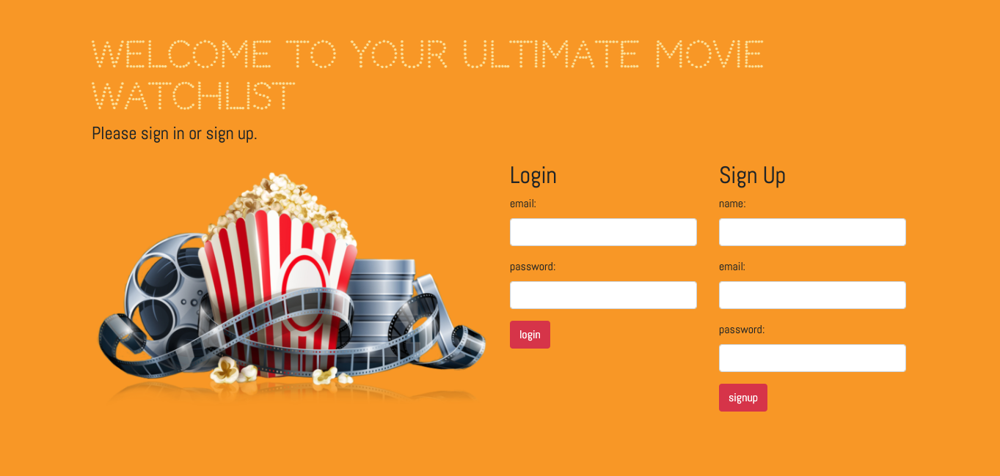
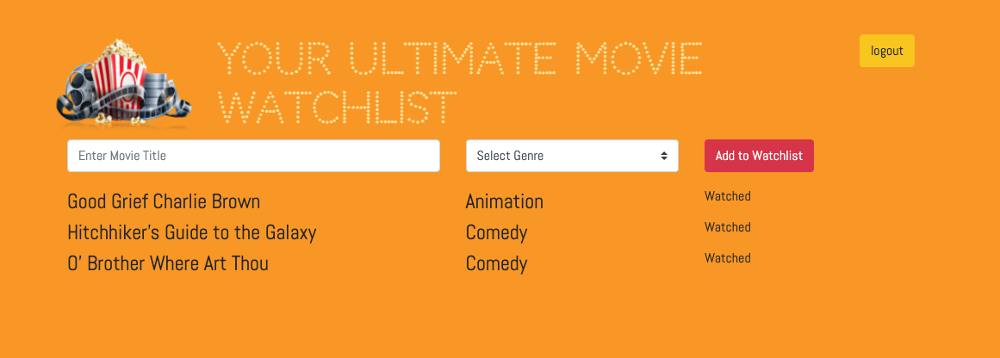

# the-ultimate-movie-list 

## Table of Contents
* [The Problem](#problem)
* [The Solution](#solution)
* [How It Was Built](#built)
* [Future Plans](#future)
* [Resources](#resources)
* [Licensing Information](#licensing)
* [Screenshots](#screenshots)

## Problem:
Have you ever rented or started a movie only to figure out later that you’ve already seen it? How many times have you looked forward to a night on the couch relaxing and watching a good movie, but you don’t know what to watch? A list of what you’ve already seen and a recommendation from a reliable friend would be great.

## Solutuion
Introducing Your Ultimate Movie Watchlist, the app that allows you to make a list of movies you want to.  Make and get recommendations from your friends.  Keep track of them your personal watchlist.

### [Please click here to view the live application](https://glacial-hollows-98883.herokuapp.com/)

## Built
We built Your Ultimate Movie Watchlist using the following technologies:
* CSS Framework: Bootstrap
* Node.js
* Express.js
* Handlebars.js
* MySQL
* Sequelize ORM
* MVC Paradigm
* Method-Override 

## Future
We want to add the following features...
* The ability for users to invite friends to join a movie-list group and only users within the friend group can view and comment on friends’ watched and unwatched movies.
* Get the third-party API call running so we can get other data such as synopsis, ratings, critic scores and images.
* Get Passport.js working with LocalStrategy as well as with Google, Facebook, possibly Twitter.

## Resources
* [Method-Override](https://www.npmjs.com/package/method-override)
* [Checkboxes](https://thisinterestsme.com/javascript-detect-checkbox-change/)
* [Sequelize Documentation](https://sequelize.org/)

## Licensing
This project is covered under the MIT license.

## Screenshots

## Collaborators
* [Katy Chadwell](https://github.com/klay824)
    * Katy built the server, routes, database connection, utilization of method-override npm, functionality of adding movies to the DB, then populating them in a list to the dashboard, as well as the functionality of chaning a movie's status from unwatched to watch (thank you Andrew)
* [Michelle Berta](https://github.com/MichelleBerta)
    * Michelle wrote all of the models and their relationships, as well as seeding out database with test information. Michelle also came up with the color scheme and the design of the application. She made the website response and look awesome.
* [Tinotenda Musikavanhu](https://github.com/Musikavanhu)
    * Tino worked on getting an api call going to get movie information from OMDB. He also worked on a comment feature and a review feature.
